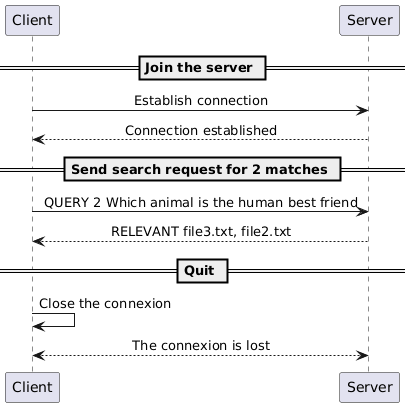
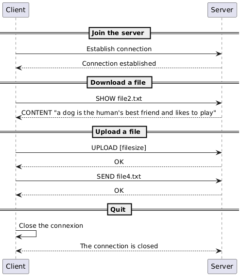
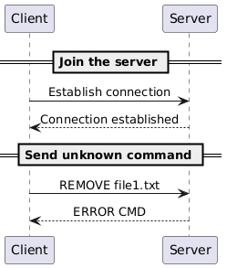
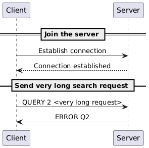

<div style="text-align: center">

# Retrivium (or BM25 over the network)

</div>


---

## Description

This project implements a complete client–server search system built on top of the BM25 ranking model.
Using a REPL-style TCP client, users can interact with the server to:

- index and upload documents

- query the most relevant files for a given search term

- list all available documents

- download their contents

---

## Table of Contents

1. [Description](#description)
2. [Overview](#overview)
3. [Protocol](#protocol)
4. [Messages](#messages)
5. [Example](#example)
6. [Commands description](#commands-description)
7. [Docker Instructions](#docker-instructions)
8. [Advantage](#advantage)
9. [Use cases](#use-cases)
10. [Repository Structure](#repository-structure)
11. [Authors](#authors)

## Overview

Retrivium is a TCP-based document search engine that implements the BM25 ranking algorithm. The protocol enables clients to:

- List indexed documents
- Search for relevant documents using queries
- Retrieve document contents
- Upload new documents to the server

The protocol uses a simple text-based request-response model with line-delimited messages.

## Protocol

The "Retrivium" protocol is a text transport protocol. It uses the TCP transport protocol to ensure the reliability of data transmission. The default port it uses is the port number 6433.

Every message must be encoded in UTF-8 and delimited by a newline character (\n). The messages are treated as text messages.

The initial connection must be established by the client.

Once the TCP connection is established, the client can send commands to the server.

The server's role is to respond to each command sent by the user.

If the server does not recognize the command, it sends an error message to the client.

On an unknown command, the server sends an error message with explanation. For malformed parameters, the server sends INVALID without detailed explanation.

The client can send multiple commands during 1 session. Client can close connection with QUIT command or by close the socket.

## Messages

The client sends text-based commands to the server. Each command is terminated by a line feed character.

### LIST

Lists all documents currently indexed on the server.


#### Request

```
LIST
```

#### Response

- `FILES <list>` if the server has indexed documents
- `NOTHING_INDEXED` if no documents are available

Example for document exist:


```
> LIST
There are 3 documents presented on the server:
file2.txt
file3.txt
file1.txt
```

Example for none indexed

```
Server has no documents to search through
```

### QUERY

Finds the top k most relevant documents using BM25 ranking.

#### Request

```
QUERY <k> <query>
```

- `<k> `: number of documents to return
- `<query>` : search terms

#### Response

- `RELEVANT <FILE1 FILE2 ...>` : at least one result
- `NOTHING_RELEVANT` : no document matches
- `NOTHING_INDEXED` : index is empty
- `INVALID <message>` : malformed query

Example output for relevant results :

```
> QUERY 2 dog
There is 1 relevant documents to your query (starting from most relevant):
file2.txt
```

Example output for no relevant results :

```
There is no relevant documents to your query
```

### SHOW

Downloads the content of the specified file.

#### Request

```
SHOW <filename>
```

#### Response

- `CONTENT <content>` : entire file content
- `FILE_DOESNT_EXIST` : file was not indexed
- `INVALID <message>` : malformed request

Example output for an existing file:

```
> SHOW file3.txt
Demanded document :
a bird is a beautiful animal that can fly
```

Example output for non-exist file

```
> SHOW file4.txt
Server does not has the demanded document
```

### UPLOAD

Uploads a new file to the server.

#### Request

```
UPLOAD <filename> <content>
```

#### Response

- `UPLOADED <filename>` : upload completed

### QUIT

Disconnect the server.

#### Request

```
QUIT
```

#### Response

The client immediately closes the connection.
No protocol message is sent by the server.

The client prints:

```
[Client] Closing connection and quitting...
```

## Example

### Functional example getting all files


### Functional example getting 2 best matches


### Functional example getting lots of best matches


### Functional example for uploading/downloading


### Send a message when query is empty


### Send a message when query is unknow


### Send a message when query is too long


---

## Commands description

_Note:_ <br/>
Docker instructions have been omitted for simplicity.

### `server` runs server instance

**Syntax:**

```bash
java -jar target/retrivium-1.0-SNAPSHOT.jar server [OPTIONS]
```

**Parameters:**

| Parameter              | Type   | Required | Default | Description                                  |
|------------------------|--------|----------|---------|----------------------------------------------|
| `-p, --port`           | Option | No       | `6433`  | port that has been listened by server        |
| `-D, --data-directory` | Option | **Yes**  | -       | Path to folder containing documents to index |


### `client` starts the repl-based client

**Syntax:**
```bash
java -jar target/retrivium-1.0-SNAPSHOT.jar client [OPTIONS]
```

| Parameter    | Type    | Required | Default | Description   |
|--------------|---------|----------|---------|---------------|
| `-p, --port` | Option  | No       | `6433`  | server's port |
| `-H, --host` | Option  | **Yes**  | -       | server's IP   |

---

## Docker Instructions

### Prerequisites

- Docker installed on your system
- Github account with a personal access token that has `packages:write` permission (please refer to [github docs](https://docs.github.com/en/authentication/keeping-your-account-and-data-secure/managing-your-personal-access-tokens) for more information)

<br>

---

### Step 1 : Build project from source

````bash
./mvnw dependency:go-offline clean compile package
````

_Note:_ <br/>
To run this step you need your PAT (personal access token) set-upped in the next way described in the [github docs](https://docs.github.com/en/packages/working-with-a-github-packages-registry/working-with-the-apache-maven-registry).

Basically you need to create (if it does not exist) `~/.m2/settings.xml` file,
and fill it with next information:

````xml
<settings xmlns="http://maven.apache.org/SETTINGS/1.0.0"
  xmlns:xsi="http://www.w3.org/2001/XMLSchema-instance"
  xsi:schemaLocation="http://maven.apache.org/SETTINGS/1.0.0
                      http://maven.apache.org/xsd/settings-1.0.0.xsd">
  <servers>
    <server>
      <id>github</id>
      <username>USERNAME</username>
      <password>TOKEN</password>
    </server>
  </servers>
</settings>

````

This all is required since this project is using [bm25](https://github.com/maxmakovskiy/bm25) library to index files.

---

### Step 2 : Build the Docker Image

```bash 
# Build the image locally with the tag "test"
docker build -t retrivium .  

# Test the build, and remove the image after exit
docker run --rm retrivium
```

<br>

--- 

### Step 3 : Create a Docker network

We need to create a network since two containers (client and server) need a way to "talk" to each other.

```bash
docker network create dai-retrivium
```

### Step 4 : Run server

Supposing user has a folder called `document` that he wants to index and search. <br/>
To start server that does this user needs to run:

````bash
docker run --rm -it --network dai-retrivium -v $(pwd)/documents:/app/documents 
--name retrivium-server retrivium server --port 6433 -D documents
````

where :
- `dai-network` network created earlier,
- `-v $(pwd)/documents:/app/documents` mounts local folder called `documents` to the container's folder `documents`
- `server --port 6433 -D documents` this part says that we want to run server that listens to the port 6433 and serves documents from `documents` folder

_Note:_ <br/>
`-D documents` and `/app/documents` is the same folder


### Step 5 : run client

Let's suppose that user has interest of enriching search server index by uploading few files,
and he has this files in the local folder called `to_upload`. 
Then to start the client that is capable of this user needs to run:

````bash
docker run --rm -it --network dai-retrivium -v $(pwd)/to_upload:/app/uploads 
retrivium client --port 6433 --host retrivium-server
````

here `-v $(pwd)/to_upload:/app/uploads` connects local folder called `to_upload`
to the client-container's folder `uploads`, this all means that while running `UPLOAD` command
user needs to specify `uploads` as the parent directory of all the files of interest.
For example `UPLOAD uploads/file10.txt`, if local `to_upload` contains `file10.txt`.

Otherwise, if there is no need to upload new files `-v $(pwd)/to_upload:/app/uploads` can be omitted.


### Step 6 (optional) : publish to GitHub Container Registry

1. Login to GitHub Container Registry with:

```bash
docker login ghcr.io -u <your_github_username>
```

<br>

--- 

2. Tag the image for GitHub Container Registry

```bash
docker tag retrivium:latest ghcr.io/<username_in_lower_case>/retrivium:latest
```

<br>

--- 

3. Publish the image on GitHub Container Registry

```bash
docker push ghcr.io/<username>/retrivium:latest
```

### Step 7 (optional) : pulling docker ready to use `retrivium` image from GitHub Registry

1. Pull the Image
```bash
docker pull ghcr.io/maxmakovskiy/retrivium:main
```

<br>

--- 

2. Run server

````bash
docker run --rm -it --network dai-retrivium -v $(pwd)/documents:/app/documents 
--name retrivium-server ghcr.io/maxmakovskiy/retrivium:main server --port 6433 -D documents
````

3. Run clients

````bash
docker run --rm -it --network dai-retrivium -v $(pwd)/to_upload:/app/uploads 
ghcr.io/maxmakovskiy/retrivium:main client --port 6433 --host retrivium-server
````
=======
  Example output:
```bash
The push refers to repository [ghcr.io/feliciacoding/retrivium]
```

## Advantage

- Multiple users
- Fast relevance ranking (BM25 algorithm)
- Real-time document uploads (UPLOAD command)
- Lightweight
- Text-based protocol (CLI)

## Use cases

- Code Snippet Repository sharing within Dev team
- Configuration File Finder sharing across DevOp team
- Log File Analysis for specific error messages or events
- legal document search for law firms
- Multi-User Collaborative Search

## Repository Structure

````
main/                                             // source
│   ├──java/
│   │   ├── ch.heigvd.dai.retrivium/
│   │   │   ├── client/
│   │   │   │   ├── ClientMessage.java            // commands available for client
│   │   │   │   ├── TcpReplClient.java            // send query from client
│   │   │   ├── cmd/ 
│   │   │   │   ├── ClientCmd.java                // client commands description
│   │   │   │   ├── RootCmd.java                  // general cli description
│   │   │   │   ├── ServerCmd.java                // server commands description
│   │   │   ├── server/ 
│   │   │   │   ├── ServerMessage.java            // commands available for server
│   │   │   │   ├── TcpServer.java                // read query sent by client
│   │   │   ├── utils/ 
│   │   │   │   ├── FileUtils.java                // File reader management
│   │   │   ├── Main.java                         // launch program
````

## Authors

- [FeliciaCoding](https://github.com/FeliciaCoding)
- [maxmakovskiy](https://github.com/maxmakovskiy)
- [AlterSpectre](https://github.com/AlterSpectre)

Kindly note the content of README file was generated with the help of ChatGPT.
