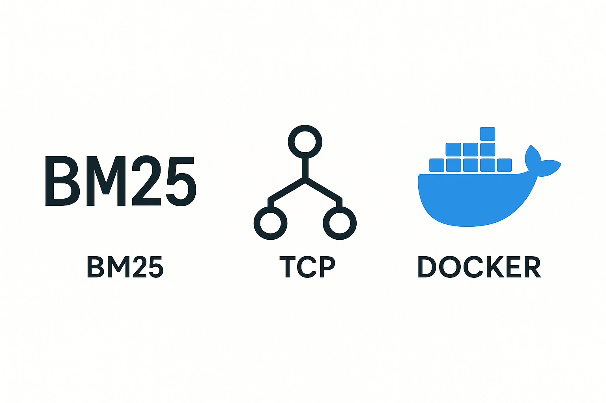
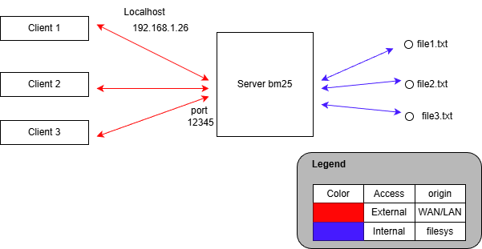
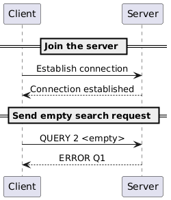

# BM25 Search Engine

## Fast and lightweight BM25-powered document search over TCP

## Authors: Liao Pei-Wen, Makovskyi Maksym, Wu Guo Yu

---

# What problem we are trying to solve ?

<br/>


---

# Our solution to the problem

<style scoped>
p { text-align: center; }
</style>

<br/>


A **TCP-based search engine** powered by **BM25 relevance ranking**, enabling:



- Real-time document indexing
- Multi-user access via TCP
- Relevance-based search (`QUERY`)
- Document browsing (`SHOW`)
- Dynamic file uploads (`UPLOAD`)
---


# How to use ?

### Using the application with Docker

1. **Pull the Image**

```bash
docker pull ghcr.io/feliciacoding/retrivium:latest
```

--- 

2. **Build the image**

```bash
docker build -t retrivium .
```

3. **Verify the build**

```bash
docker run --rm retrivium
```

4. **Prepare data**
   Create a directory with text files that will be indexed and searchable.

```bash
mkdir -p data && echo "Machine learning content" > data/ml.txt
```

5. **Create network**
   Create a Docker network so the server and client containers can communicate.

```
docker network create dai-retrivium
```

6. **Start server**
   Run the server container that will index documents and listen for client connections.

```bash
# Use custom network, NO port publishing needed
docker run --rm -it --network dai-retrivium -v "$(pwd)/data:/app/data" --name my-server retrivium server --data-directory /app/data
```

7. **Start client (new terminal)**
   Connect a client to the server using the container name as hostname.

```bash 
# Run the client container
docker run --rm -it --network dai-retrivium retrivium client --host my-server --port 6433
```

8. **Test commands**
   Try searching and listing documents in the client prompt.

```bash 
# Type in the client terminal
> LIST
> QUIT
```

9. **Stop Server**
   Stop the server container when finished. To stop the server, press `Ctrl+C`, or run:

```bash
# Press Ctrl+C in server terminal or run
docker stop my-server
```

10. **Clean up**
    Remove the Docker network and data directory.

```bash
# Remove the network
docker network rm dai-retrivium
```


---

# How it works ? 




---

# Example


---

# Example





---

# Use Cases

- Code Snippet Repository
  
```bash  
> Query 5 binary search tree implementation
```

- Configuration File Finder
  
```bash  
Find which service has connection timeout set too low
> QUERY 5 timeout connection 30 seconds
> SHOW <suspicious-config.conf>
```  
  
- Log File Analysis
  
```bash  
Folder contains daily server logs
> QUERY 5 error 404 authentication failed  
```

- Legal document search
  
```bash  
> QUERY 10 intellectual property patent infringement  
```  
  

---


# Roadmap - Current Limitations & Planned Improvements (1)

1. **Java locks**

[Limitation]
Race conditions  

<br>

2. **Authentication & Security**  

[Limitation] 
- No encryption - data transmitted in plain text (TCP)  
- No authentication - anyone can connect  
- No access control - all users see all documents  
- No audit logs - can't track who searched what  

[Improvement]
- User authentication with username/password or API keys  
- TLS/SSL encryption for secure transmission  
- Role-based access control  


---

# Roadmap - Current Limitations & Planned Improvements (2)

3 **Persistent Index Storage**  

[Limitation] 
- Index stored only in memory  
- Re-indexes ALL documents on every server restart  
- Loses index when server stops  
- Slow startup with large document collections  

[Improvement]
- Save index to disk (serialization or database)  
- Incremental indexing - only index changed files  
- Fast startup by loading pre-built index  
- Support for very large datasets  


---

<br>

# Thank you for your attention !


