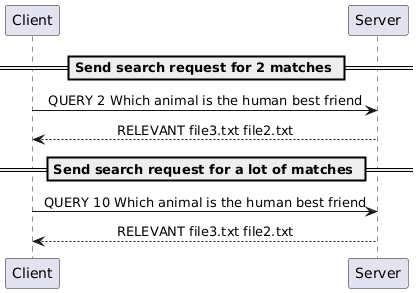
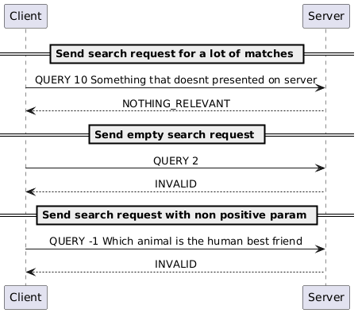
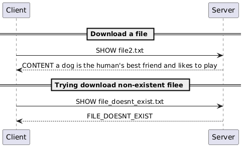
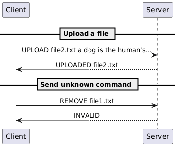

# Retrivium

## BM25 over the network

## Authors: Liao Pei-Wen, Makovskyi Maksym, Wu Guo Yu

---

# What problem we are trying to solve ?

<style scoped>
p { text-align: center; }
</style>


---

# Our solution to the problem (1)


- Real-time document indexing
- Multi-user access via TCP
- Relevance-based search (`QUERY`)
- Document browsing (`SHOW`)
- Dynamic file uploads (`UPLOAD`)

---

# How to use ? (1)

1. **Pull the Image**

```bash
docker pull ghcr.io/maxmakovskiy/retrivium:main
```

--- 

# How to use ? (2)

2. **Create the network**

```bash
docker network create dai-retrivium
```

---

# How to use ? (3)

3. **Prepare data**
Create a directory with text files that will be indexed and searchable.
For example:

```bash
$ mkdir data && cd data
$ mkdir docs
$ echo "a cat is a feline and likes to eat bird" > docs/file1.txt
$ echo "a dog is the human's best friend and likes to play" > docs/file2.txt
$ echo "a bird is a beautiful animal that can fly" > docs/file3.txt
$ mkdir uploads
$ echo "April always begins on the same day of the week as July" > uploads/file10.txt
```

---

# How to use ? (4)

4. **Start server**

```bash
$ docker run --rm -it --network dai-retrivium \
$ -v $(pwd)/documents:/app/documents --name retrivium-server \
$ ghcr.io/maxmakovskiy/retrivium:main server --port 6433 -D documents
```

---

# How to use ? (5)

5. **Start client**

```bash 
$ docker run --rm -it --network dai-retrivium \
$ -v $(pwd)/to_upload:/app/uploads \
$ ghcr.io/maxmakovskiy/retrivium:main client --port 6433 --host retrivium-server

```

---

# How to use ? (6)

6. **Test commands**
Try searching and listing documents in the client prompt.

```bash 
# Type in the client terminal
> LIST
> QUIT
```

---

# How it works ? 

<style scoped>
p { text-align: center; }
</style>


---

# Example (1) : connect and list

<style scoped>
p { text-align: center; }
</style>


---

# Example (2) : query success

<style scoped>
p { text-align: center; }
</style>



---

# Example (3) : query fail

<style scoped>
p { text-align: center; }
</style>



---

# Example (4) : download

<style scoped>
p { text-align: center; }
</style>



---

# Example (5) : download and ill-formed cmd

<style scoped>
p { text-align: center; }
</style>



---


# Use Cases (1)

- Code Snippet Repository
  
```bash  
> Query 5 binary search tree implementation
```

- Configuration File Finder
  
```bash  
Find which service has connection timeout set too low
> QUERY 5 timeout connection 30 seconds
> SHOW <suspicious-config.conf>
```  

---

# Use Cases (2)

- Log File Analysis
  
```bash  
Folder contains daily server logs
> QUERY 5 error 404 authentication failed  
```

- Legal document search
  
```bash  
> QUERY 10 intellectual property patent infringement  
```  

---


# Roadmap - Current Limitations & Planned Improvements (1)

1. **Java locks**

[Limitation]
Race conditions  


---

# Roadmap - Current Limitations & Planned Improvements (2)

2. **Authentication & Security**  

[Limitation] 
- No encryption - data transmitted in plain text (TCP)  
- No authentication - anyone can connect  
- No access control - all users see all documents  
- No audit logs - can't track who searched what  

---

# Roadmap - Current Limitations & Planned Improvements (3)

3. **Authentication & Security (continue)**  

[Improvement]
- User authentication with username/password or API keys  
- TLS/SSL encryption for secure transmission  
- Role-based access control  

---

# Roadmap - Current Limitations & Planned Improvements (4)

4 **Persistent Index Storage**  

[Limitation] 
- Index stored only in memory  
- Re-indexes ALL documents on every server restart  
- Loses index when server stops  
- Slow startup with large document collections  

---

# Roadmap - Current Limitations & Planned Improvements (5)

5 **Persistent Index Storage (continue)**  

[Improvement]
- Save index to disk (serialization or database)  
- Incremental indexing - only index changed files  
- Fast startup by loading pre-built index  
- Support for very large datasets  

---

<br>

# Thank you for your attention !


